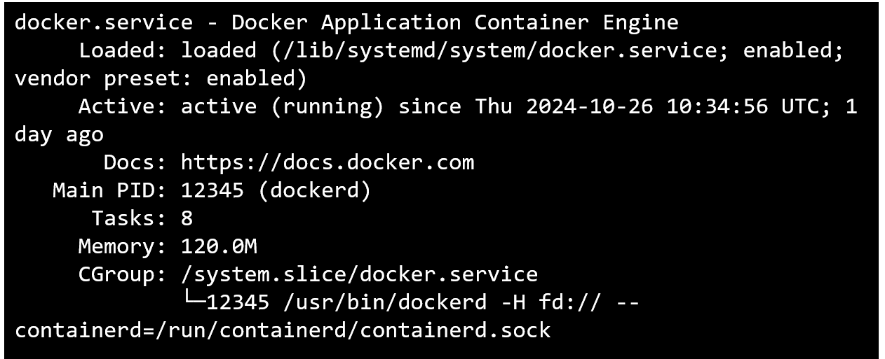
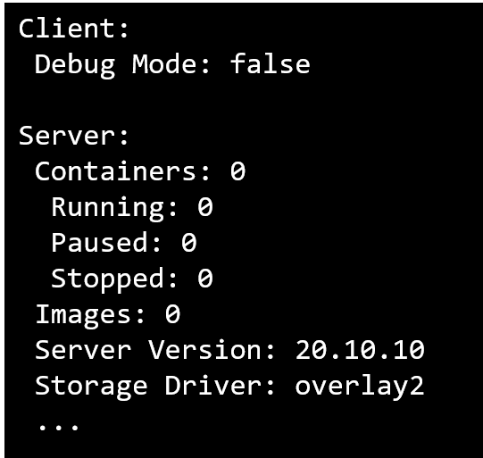

# Práctica 1.1 Instalación Docker


## Objetivo 
Al finalizar esta actividad, serás capaz de instalar y configurar Docker en un entorno Linux utilizando máquinas virtuales.

## Duración aproximada
35 minutos

## Requisitos del Sistema

- Docker se puede instalar en varias distribuciones de Linux, incluyendo:
    - Ubuntu (versión 18.04 o posterior es recomendada)
    - Debian (Buster o posterior)
    - CentOS (7 o posterior)
    - Fedora (34 o posterior)
    - RHEL (7 o posterior)

- Docker solo es compatible con arquitecturas de 64 bits.

- Es necesario que el sistema tenga un kernel de Linux versión 3.10 o posterior. Puedes verificar la versión del kernel ejecutando:

```bash
uname -r
``` 

- Habilitar el módulo de overlay y overlay2, ya que Docker utiliza estos sistemas de archivos como el controlador de almacenamiento por defecto.

- Permisos de Usuario
    - Docker necesita permisos de administrador para su instalación y configuración. Usualmente, los comandos se ejecutan con **sudo**.


## Instrucciones

1. **Consulta con tu instructor**

Pregunta a tu instructor cómo acceder al entorno de prácticas del curso y asegúrate de entender todas las instrucciones necesarias para su acceso este día y los días siguientes de clase.

    - ¿Cuántas máquinas virtuales tienes?
    - ¿Cuáles son los sistemas operativos que tienes en cada máquina?

2. ***Actualiza e instala los paquetes requeridos:***

```bash
sudo apt update
sudo apt upgrade
sudo apt install apt-transport-https ca-certificates curl software-properties-common
```

3. ***Agrega la clave de Docker y el repositorio***

```bash
curl -fsSL https://download.docker.com/linux/ubuntu/gpg | sudo gpg --dearmor -o /usr/share/keyrings/docker-archive-keyring.gpg
```

Luego, agrega el repositorio
```bash
sudo add-apt-repository "deb [arch=amd64] https://download.docker.com/linux/ubuntu $(lsb_release -cs) stable"
```

4. ***Actualiza de nuevo e instala Docker***
```bash
sudo apt update
apt-cache policy docker-ce
sudo apt install docker-ce
```

5. ***Verifica de Docker*** 

```bash
sudo systemctl status docker
```

6. ***Configura adicionalmente***

```bash
docker --version
id -nG
sudo usermod -aG docker <usuario>  # Reemplaza <usuario> con el nombre de tu usuario
cat /etc/group
```

***Nota:*** Para que los cambios en el grupo se apliquen, es recomendable cerrar y volver a abrir la sesión del usuario o ejecutar `newgrp docker`

## Resultado Esperado

- docker --version


***Nota:*** La versión de Docker podría cambiar.

- sudo systemctl status docker




- docker info



 
- docker run hello-world


 


