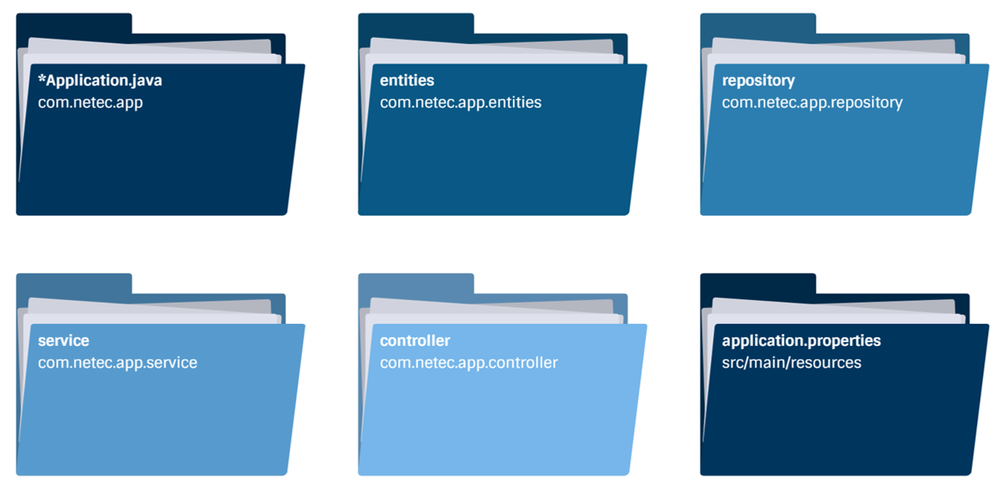
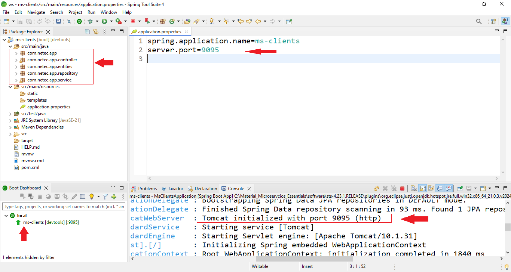

# Práctica 1.3 Clonar, Importar, Analizar un Microservicio en Java

## Objetivo

Al finalizar esta actividad, serás capaz de clonar un repositorio de microservicio en Java, importarlo en el entorno de desarrollo y analizar su estructura y componentes principales

## Duración aproximada

45 minutos

## Instrucciones

1. **Clonar el repositorio**

    - Accede al repositorio inicial de las prácticas donde se encuentra el código.
    - Clona el repositorio en tu máquina loca, si aún no lo has hecho, ejecutando el siguiente comando en la terminal:

    ```bash
    
    git clone <URL_DEL_REPOSITORIO>
    ```

    - Navega al directorio de la unidad donde se encuentra el código del microservicio:

    ```bash
    
    cd <nombre_del_repositorio>/unidad1/code/ms-clients
    ```


2. **Importar el proyecto en el entorno de desarrollo**

    - Abre tu entorno de desarrollo integrado (IDE), como STS o VSC.
    - Importa el proyecto:
        - En STS: Selecciona File > Import..., navega a la carpeta ms-clients y selecciona Open as Project.

        - En VSC: Selecciona Archivo > Abrir Carpeta..., navega a la carpeta ms-clients y selecciona Finish.

    - Espera a que el IDE cargue al **100%** todas las dependencias de Maven y compile el proyecto.


3. **Analizar la estructura del microservicio**

    - Revisa los paquetes principales y los archivos en el proyecto. Identifica los siguientes componentes clave:

        - Modelo (entity): Revisa la clase que representa los datos principales (por ejemplo, Client).
        - Repositorio (repository): Examina la interfaz del repositorio que extiende JpaRepository u otra clase de repositorio.
        - Servicio (service): Observa la capa de lógica de negocio y los métodos implementados para gestionar la entidad.
        - Controlador (controller): Identifica los endpoints de la API que permiten interactuar con el microservicio.

    - Familiarízate con la estructura de carpetas, especialmente las carpetas src/main/java y src/main/resources.


4. **Ejecutar y verificar la configuración**

    - Si es posible, ejecuta el microservicio desde el IDE para asegurarte de que la configuración inicial es correcta. Puedes hacerlo desde la clase principal del microservicio, generalmente una clase anotada con @SpringBootApplication.
    
    - Accede a la consola para revisar cualquier mensaje de error o éxito que confirme la correcta inicialización del servicio.

5. **Conclusión y análisis**

    - Reflexiona sobre los componentes y su función en la arquitectura del microservicio.
    - Anota cualquier pregunta o área que desees profundizar en relación con el microservicio o la estructura general de una aplicación en Spring Boot. 
    - Pregunta a tu instructor cualquier duda de Java.


6. **Consume el microservicio**

    - Usando Postman, Insomia o curl consume los endpoints de tu microservicio

| **Operación**                | **Método HTTP** | **URL**                                      | **Descripción**                                                |
|------------------------------|-----------------|----------------------------------------------|----------------------------------------------------------------|
| Obtener todos los clientes   | `GET`           | `http://localhost:9095/api/clients`          | Devuelve una lista de todos los clientes.                       |
| Obtener un cliente por ID    | `GET`           | `http://localhost:9095/api/clients/{id}`     | Devuelve un cliente específico, identificado por su `id`.       |
| Crear un nuevo cliente       | `POST`          | `http://localhost:9095/api/clients`          | Crea un nuevo cliente con los datos proporcionados en el cuerpo de la solicitud. |
| Actualizar un cliente        | `PUT`           | `http://localhost:9095/api/clients/{id}`     | Actualiza los datos de un cliente existente, identificado por su `id`. |
| Eliminar un cliente          | `DELETE`        | `http://localhost:9095/api/clients/{id}`     | Elimina un cliente específico, identificado por su `id`.        |

 

## Resultado Esperado

- Al analizar el microservicio, deberás encontrar carpetas similares a las siguientes:





- **Contesta lo siguiente**

    a. ¿Identificaste y comprendiste el propósito de cada uno de los paquetes principales, como entity, repository, service y controller, en la estructura del proyecto?

    b. ¿Pudiste explicar el flujo de datos en el microservicio, desde la capa de controlador hasta el repositorio, y cómo interactúan entre sí?

    c. ¿Entendiste la función de cada endpoint en el controlador y cómo se mapean a las operaciones CRUD en el servicio?


- Al ejecutar tu proyecto deberás de ver una imagen similar a la siguiente:




 
- **Contesta lo siguiente**

    a. ¿Identificaste la entidad principal, sus atributos y cómo está mapeada a la base de datos mediante JPA?

    b. ¿Cuál es el puerto asignado a este microservicio?
