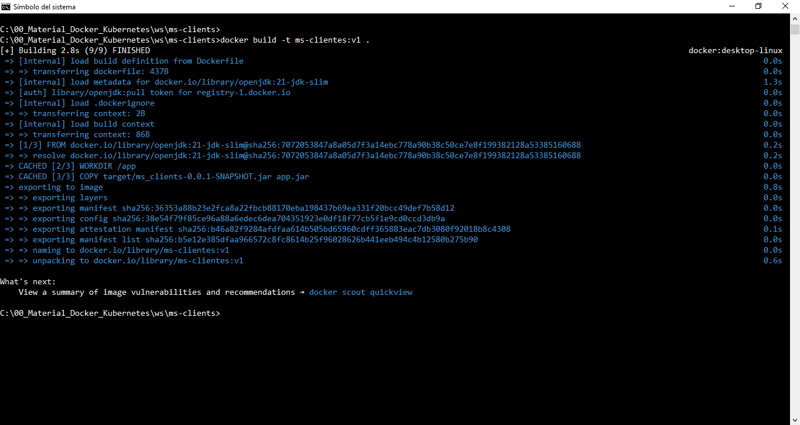
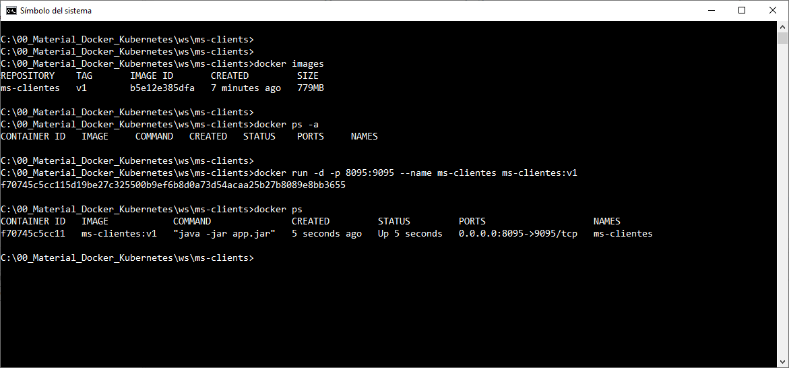
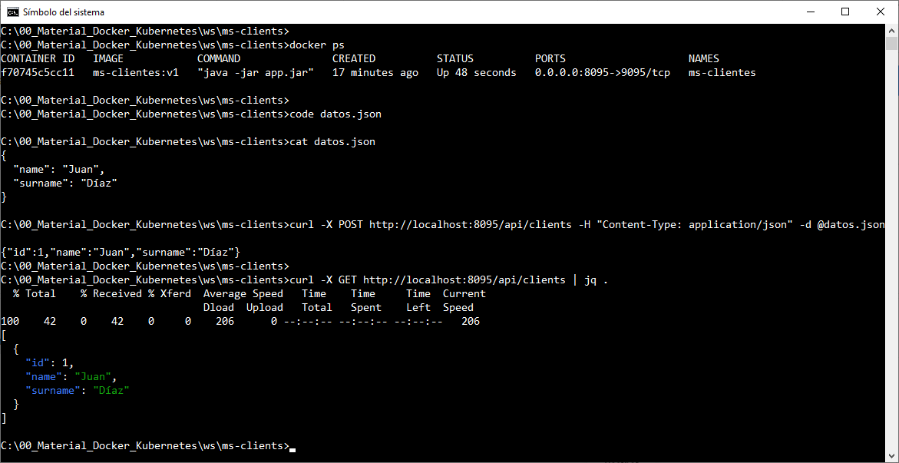

# Práctica 1.4 Construir Imagen y Contenedor Docker

## Objetivo

Al finalizar esta actividad, serás capaz de crear una imagen Docker a partir de un Dockerfile y desplegar un contenedor basado en esa imagen.

## Duración aproximada

30 minutos

## Instrucciones

# Práctica 1.4: Construir Imagen y Contenedor Docker

## Objetivo

Al finalizar esta actividad, serás capaz de crear una imagen Docker a partir de un Dockerfile y desplegar un contenedor basado en esa imagen.

---

### Instrucciones

1. **Crear un Dockerfile para la aplicación**

   - Navega a la raíz del proyecto donde se encuentra tu aplicación Spring Boot.

   - Crea un archivo llamado `Dockerfile` (sin extensión).
   
   - Abre el archivo `Dockerfile` y escribe las siguientes instrucciones básicas:

     ```dockerfile
     # Utilizar una imagen base de Java (ajusta la versión si es necesario)
     FROM openjdk:21-jdk-slim

     # Crear un directorio para la aplicación
     WORKDIR /app

     # Copiar el archivo JAR generado al contenedor
     COPY target/ms_clients-0.0.1-SNAPSHOT.jar app.jar

     # Exponer el puerto que usa la aplicación
     EXPOSE 9095

     # Comando para ejecutar la aplicación
     ENTRYPOINT ["java", "-jar", "app.jar"]
     ```

   - Guarda el archivo `Dockerfile`.

2. **Construir la imagen Docker**

   - Abre la terminal en el directorio raíz de tu proyecto.

   - Asegúrate de que el archivo JAR de tu aplicación ya esté generado en la carpeta `target`. Si no está, ejecuta el siguiente comando para compilarlo:

     ```bash
     mvn clean package
     ```

    - **Nota**: Puedes compilarlo y empaquetarlo como se vió en clase, esto es con, `mvnw` en lugar de `mvn`.

   - Una vez que el archivo JAR esté listo, construye la imagen Docker con el siguiente comando (reemplaza `<nombre_de_imagen>` y `<versión>` por un nombre y versión para la imagen):

     ```bash
     docker build -t ms-clientes:v1 .
     ```

3. **Verificar la imagen creada**

   - Ejecuta el siguiente comando para ver la lista de imágenes y confirmar que tu imagen fue creada exitosamente:

     ```bash
     docker images
     ```

4. **Desplegar un contenedor basado en la imagen**

   - Inicia un contenedor a partir de la imagen creada, mapeando el puerto 8095 del contenedor al puerto 9095 de tu máquina local:

     ```bash
     docker run -d -p 8095:9095 --name ms-clientes ms-clientes:v1
     ```

   - La aplicación debería estar disponible en `http://localhost:8095`.


5. **Verificar que el contenedor esté en ejecución**

   - Usa el siguiente comando para listar los contenedores en ejecución y confirmar que tu aplicación está desplegada:

     ```bash

     docker ps
     docker logs ms-clientes
     ```

6. **Detener el contenedor**

   - Si deseas detener el contenedor en ejecución, identifica el `CONTAINER ID` usando el comando `docker ps`, y luego ejecuta:

     ```bash
     docker stop ms-clientes
     ```


## Resultado Esperado

- Captura de pantalla al construir la imagen Docker




- Captura de pantalla que verifica las imagens, verifica los contenedores, crea un nuevo contenedor y verifica el estado del nuevo contenedor.




- Captura de pantall que verifica que el contenedor Docker se encuentre en ejecución, ademas de mostrar los consumos, usando curl.

