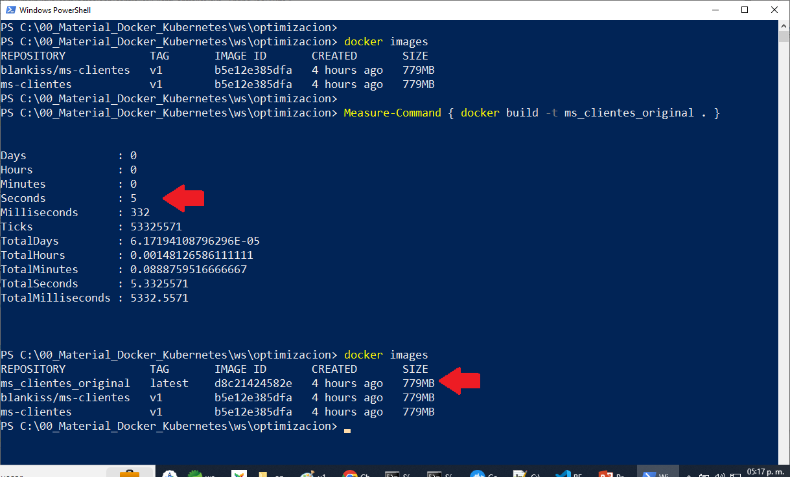
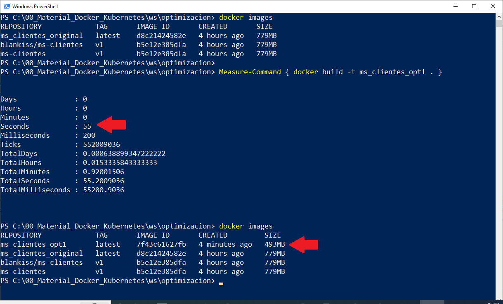
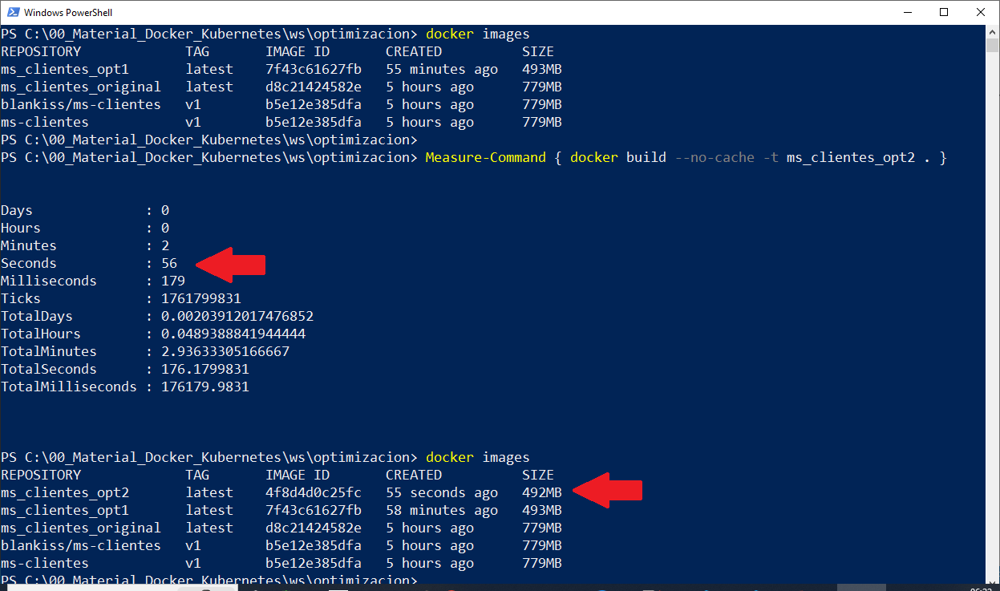
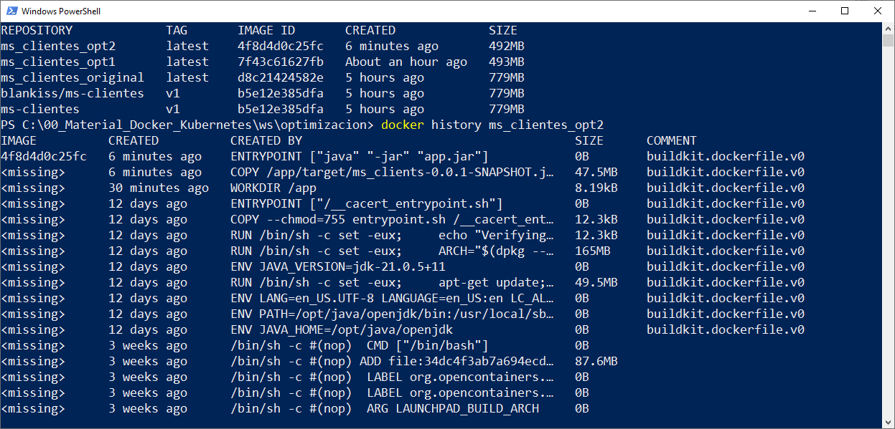

# Práctica 1.7 Optimización

## Objetivo
Al finalizar esta actividad, serás capaz de optimizar un Dockerfile aplicando prácticas recomendadas para reducir el tamaño de la imagen, mejorar la velocidad de construcción y minimizar el uso de recursos


## Duración aproximada
20 minutos

## Instrucciones

### Paso 1: Clonar el Dockerfile Actual

1. **Crear un Directorio de Trabajo:**

    - Crea un nuevo directorio donde puedas trabajar en la optimización del Dockerfile.

```bash

mkdir optimizacion
cd optimizacion
cp -rp <dir_proyecto>/src .
cp -p <dir_proyecto>/pom.xml .
cp -p <dir_proyecto>/target/ms_clients-0.0.1-SNAPSHOT.jar .
```

2. **Copiar el Dockerfile Actual:**

    - Crea un archivo Dockerfile en este directorio y copia el contenido actual:

```dockerfile

FROM openjdk:21-jdk-slim
WORKDIR /app
COPY ms_clients-0.0.1-SNAPSHOT.jar app.jar
EXPOSE 9096
ENTRYPOINT ["java", "-jar", "app.jar"]

```

3. **Construir y Medir la Imagen Original:**

    - Construye la imagen Docker con el siguiente comando y toma nota del tiempo de construcción.
```bash
 
time docker build -t ms_clients_original .
```

- **Nota:** Si estas en Windows puedes usar una terminal Power Shell con la siguiente instrucción:

```PowerShell

Measure-Command { docker build -t ms_clients_original . }

```


- Verifica el tamaño de la imagen usando:

```bash
 
docker images  
```

- Registra el tamaño de la imagen y el tiempo de construcción en la tabla como "Antes de Optimización".


<br/><br/>

### Paso 2: Cambiar la Imagen Base para Reducir el Tamaño


1. **Cambiar de openjdk:21-jdk-slim a eclipse-temurin:21-jre-jammy:**

    - En el Dockerfile, reemplaza **openjdk:21-jdk-slim** con **eclipse-temurin:21-jre-jammy** para usar solo el entorno de ejecución (JRE) en lugar del kit de desarrollo (JDK). Esto reduce el tamaño porque solo necesitas ejecutar el JAR, no compilarlo.

    - Modifica el `Dockerfile`:

```dockerfile
 
FROM eclipse-temurin:21-jre-jammy
WORKDIR /app
COPY ms_clients-0.0.1-SNAPSHOT.jar app.jar
EXPOSE 9096
ENTRYPOINT ["java", "-jar", "app.jar"]
```

2. **Construir y Medir el Tamaño de la Nueva Imagen:**

    - Guarda el Dockerfile y construye de nuevo la imagen.

```bash
 
time docker build -t ms_clients_op1 .
```

- Verifica el tamaño de la imagen y el tiempo de construcción con los mismos comandos de antes. Registra los resultados en la columna "Después de Optimización".


<br/><br/>

### Paso 3: Implementar Multi-Stage Build (Compilación en Varias Etapas)

1. **Configurar Etapa de Compilación en el Dockerfile:**

    - Modifica el `Dockerfile` para implementar una compilación en varias etapas. En esta configuración, usarás una imagen Maven para compilar el proyecto y luego solo copiarás el archivo JAR compilado a una imagen más ligera.

    - Cambia el `Dockerfile` a lo siguiente:

```dockerfile

# Etapa de construcción
FROM maven:3.8-eclipse-temurin-21 AS builder
WORKDIR /app
COPY pom.xml .
RUN mvn dependency:go-offline

COPY src ./src
RUN mvn package -Dmaven.test.skip=true

# Etapa de ejecución
FROM eclipse-temurin:21-jre
WORKDIR /app
COPY --from=builder /app/target/ms_clients-0.0.1-SNAPSHOT.jar app.jar
ENTRYPOINT ["java", "-jar", "app.jar"]
 
```

2. **Construir la Imagen Multi-Stage:**

    - Guarda el archivo y construye la imagen.

```bash
 
time docker build -t ms_clients_opt2 .
```

- Verifica el tamaño de la imagen resultante y toma nota del tiempo de construcción.

3. **Actualizar la Tabla de Resultados:**

    - Registra los valores en la columna "Después de Optimización".


<br/><br/>

### Paso 4: Verificar el Número de Capas

1. **Inspeccionar las Capas de la Imagen:**

    - Para verificar cuántas capas tiene la imagen, usa el siguiente comando:

```bash

docker history ms_clients_optimized_multistage
```

    - Anota el número de capas en la tabla para la imagen antes y después de la optimización.


<br/><br/>
### Paso 5: Medir el Tiempo de Inicio del Contenedor

1. **Ejecutar el Contenedor y Medir el Tiempo de Inicio:**

    - Ejecuta el contenedor y mide el tiempo de inicio para ver cuánto tarda en estar listo en el puerto 9095.

```bash
 
time docker run --rm -p 9095:9095 ms_clients_optimized_multistage
```

- Puedes observar en el registro de salida cuándo la aplicación está lista para recibir solicitudes y tomar nota del tiempo en segundos.

2. **Actualizar la Tabla con el Tiempo de Inicio:**

    - Anota el tiempo de inicio en la tabla.


<br/><br/>

### Paso 6: Observaciones y Conclusiones

1. **Multi-Stage Build:** Asegúrate de registrar si se utilizó multi-stage build en la columna correspondiente de la tabla.

2. **Comparación y Análisis:**

    - Compara los resultados antes y después de las optimizaciones.

    - Escribe una breve conclusión sobre cómo las optimizaciones afectaron el tamaño de la imagen, el tiempo de construcción y el tiempo de inicio.


<br/><br/>
## Resultado Esperado

<br/><br/>
- Captura de pantalla para la creación de la primera imagen base, en este caso, ms_clientes_original



<br/><br/>
- Captura de pantalla para la creación de la segunda imagen, cambiando solo la imagen base de Java, en este caso, ms_clientes_opt1



<br/><br/>
- Captura de pantalla para la creación de la tercera imagen, aplicando multi-stage, en este caso, ms_clientes_opt2



<br/><br/>
- Captura de pantalla revisando las étapas de la imagen mx_clientes_opt2

