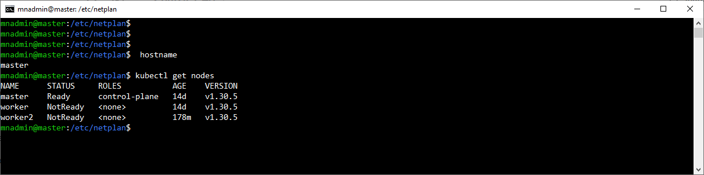
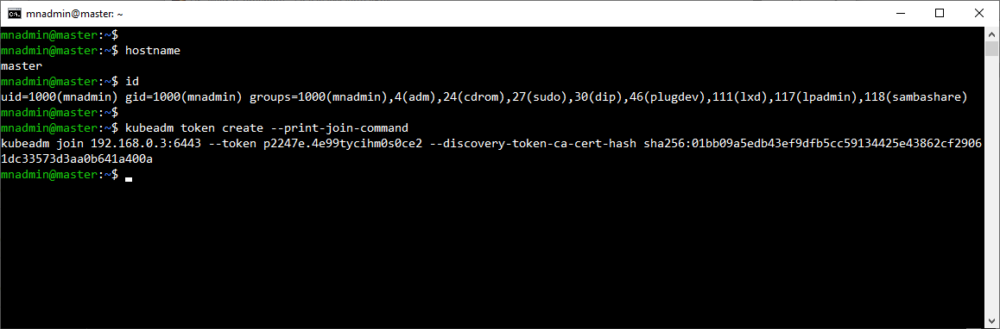
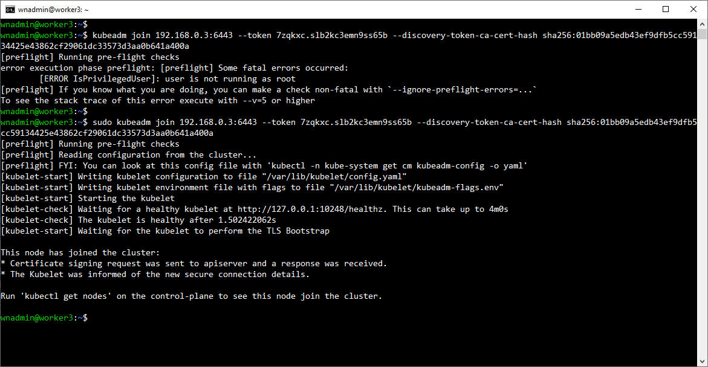
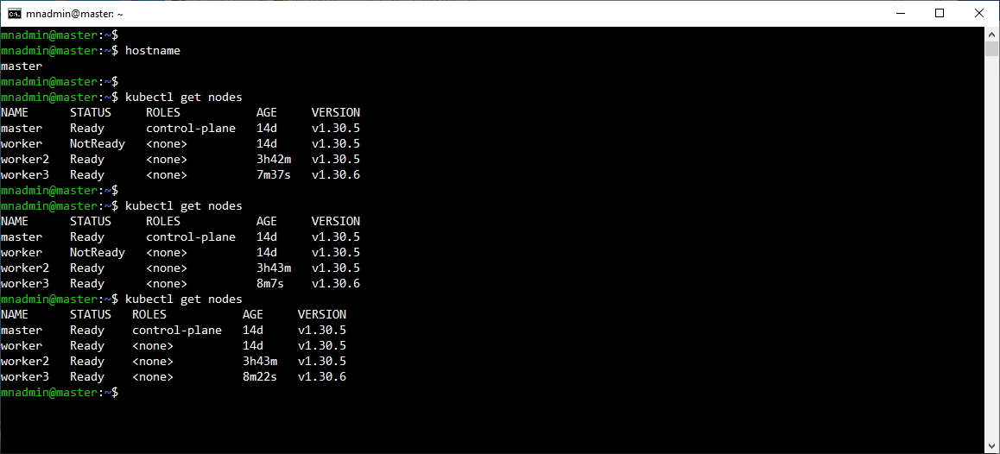

# Práctica 2.3 Agregación de un nuevo Worker Node al Clúster.

## Objetivo

Al finalizar esta actividad, serás capaz de verificar correctamente la instalación y configuración de un Worker Node en un clúster de Kubernetes.


## Duración aproximada

30 minutos

## Instrucciones

<br/>

**Paso 1: Intalar paquetería básica**

- Actualiza los repositorios e instala los paquetes necesarios para el transporte de paquetes HTTPS.

```bash
sudo apt-get update 
sudo apt install apt-transport-https curl -y
```

<br/>

**Paso 2: Preconfigurar el Networking**

- Configura los módulos necesarios para Kubernetes y aplica los parámetros de red.

```bash
cat <<EOF | sudo tee /etc/modules-load.d/k8s.conf
overlay
br_netfilter
EOF

sudo modprobe overlay
sudo modprobe br_netfilter

```

- Define los parámetros de `sysctl` necesarios para el funcionamiento de Kubernetes

```bash
cat <<EOF | sudo tee /etc/sysctl.d/k8s.conf
net.bridge.bridge-nf-call-iptables  = 1
net.bridge.bridge-nf-call-ip6tables = 1
net.ipv4.ip_forward                 = 1
EOF

# Aplicar parámetros de sysctl
sudo sysctl --system

```

- Verifica que los módulos estén correctamente cargados

```bash
lsmod | grep br_netfilter
lsmod | grep overlay

```

- Confirma que los parámetros de red estén configurados.

```bash

sysctl net.bridge.bridge-nf-call-iptables net.bridge.bridge-nf-call-ip6tables net.ipv4.ip_forward

```

<br/>

**Paso 3: Deshabilitar el Swap**

- Desactiva el uso de swap temporalmente

```bash

sudo swapoff -a
```

- Para que esta configuración sea permanente, edita el archivo `/etc/fstab` y comenta la línea correspondiente a swap. Luego, reinicia la máquina.

<br/>

**Paso 4: Intalar containerd**

- Añade la clave GPG oficial de Docker.

```bash

sudo apt-get update 
sudo apt-get install ca-certificates curl 
sudo install -m 0755 -d /etc/apt/keyrings 
sudo curl -fsSL https://download.docker.com/linux/ubuntu/gpg -o /etc/apt/keyrings/docker.asc 
sudo chmod a+r /etc/apt/keyrings/docker.asc 
```

- Agrega el repositorio de Docker a las fuentes de `apt`

```bash
echo \
  "deb [arch=$(dpkg --print-architecture) signed-by=/etc/apt/keyrings/docker.asc] https://download.docker.com/linux/ubuntu \
  $(. /etc/os-release && echo "$VERSION_CODENAME") stable" | \
  sudo tee /etc/apt/sources.list.d/docker.list > /dev/null
```

- Actualiza los paquetes e instala `docker-ce`, `docker-ce-cli`, `containerd.io`, `docker-buildx-plugin` y `docker-compose-plugin`.

```bash

sudo apt-get update 
sudo apt-get install docker-ce docker-ce-cli containerd.io docker-buildx-plugin docker-compose-plugin
```

<br/>

**Paso 5: Habilitar containerd como Runtime de Contenedor**

- Modifica el archivo de configuración de containerd para habilitar `SystemdCgroup`.

```bash
[plugins."io.containerd.grpc.v1.cri".containerd.runtimes.runc]
  [plugins."io.containerd.grpc.v1.cri".containerd.runtimes.runc.options]
    SystemdCgroup = true

```
<br/>

**Paso 6: Reiniciar containerd**

- Reinicia el servicio de containerd para aplicar los cambios.

```bash

sudo systemctl restart containerd
```

<br/>

**Paso 7: Actualizar e instalar paquetería necesaria**

- Actualiza los repositorios e instala los paquetes necesarios para Kubernetes.

```bash

sudo apt-get update
sudo apt-get install -y apt-transport-https ca-certificates curl gpg

```
<br/>

**Paso 8: Descargar y agregar repositorios de Kubernetes**

- Añade la clave GPG del repositorio de Kubernetes y configura la fuente de apt para Kubernetes.

```bash

curl -fsSL https://pkgs.k8s.io/core:/stable:/v1.30/deb/Release.key | sudo gpg --dearmor -o /etc/apt/keyrings/kubernetes-apt-keyring.gpg
echo 'deb [signed-by=/etc/apt/keyrings/kubernetes-apt-keyring.gpg] https://pkgs.k8s.io/core:/stable:/v1.30/deb/ /' | sudo tee /etc/apt/sources.list.d/kubernetes.list    

```
<br/>

**Paso 9: Instalar kubelet, kubeadm y kubectl**

- Actualiza los repositorios e instala los componentes principales de Kubernetes.

```bash

sudo apt-get update
sudo apt-get install -y kubelet kubeadm kubectl
sudo apt-mark hold kubelet kubeadm kubectl

```

<br/>

**Paso 10: Unir el Worker Node al Control Plane**

- Utiliza el comando `kubeadm join` para unir este Worker Node al clúster. Desde el nodo maestro, genera el comando de unión:

```bash

kubeadm token create --print-join-command

```

- Ejecuta el comando generado en el**Worker Node** para unirte al clúster:

```bash

sudo kubeadm join <ip-controlplane>:6443 --token <token> --discovery-token-ca-cert-hash sha256:<hash>

```


**Nota:** 
    
    - Asegúrate de reemplazar `<ip-controlplane>`, `<token>` y `<hash>` con los valores correctos generados en el nodo maestro.

<br/><br/>

## Resultado Esperado

- Captura de pantalla con el estado inicial (esto es antes de iniciar las intrucciones documentadas arriba) del clúster.



<br/>

- Captura de pantalla en el nodo maestro para obtener el token e instrucción completa del **join**.



<br/>

- Captura de pantalla en el nodo worker con la instrucción del **join**.



<br/>

- Captura de pantalla en el nodo maestros, con `kubectl get nodes`, monitoreado en varios instantes hasta que los nodos se han agregado.


