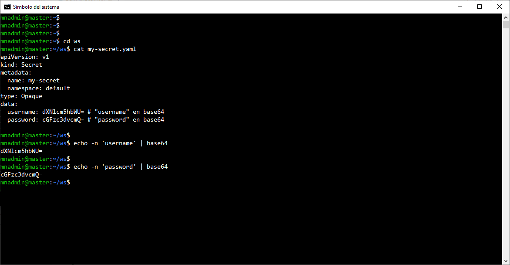
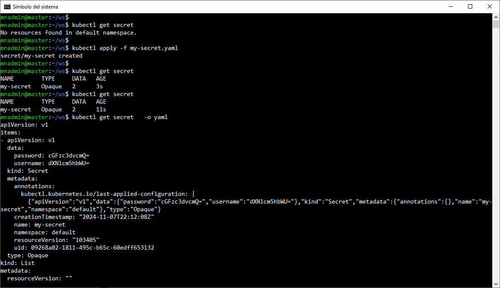
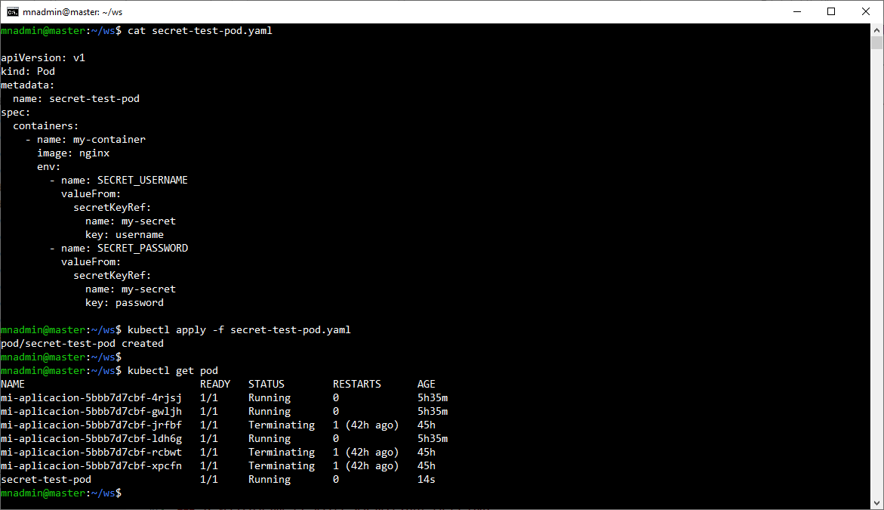
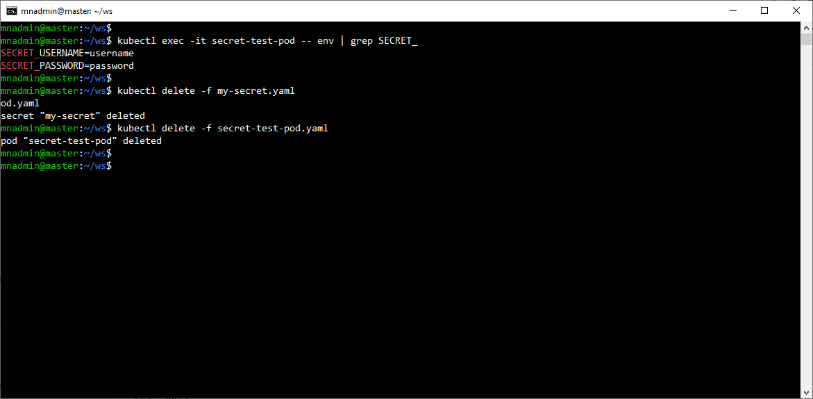

# Práctica 4.2 Creación de Secrets en K8s

## Objetivo
Al finalizar esta práctica, serás capaz de crear Secrets en Kubernetes utilizando YAML


## Duración aproximada
15 minutos

## Instrucciones

### 1. Define el Secren en YAML

-  Crea un archivo YAML llamado **my-secret.yaml** en el cual se definirá el Secret. A continuación, se muestra un ejemplo de cómo definir un Secret con datos de **usuario** y **contraseña** codificados en base64.

```yaml

apiVersion: v1
kind: Secret
metadata:
  name: my-secret
  namespace: default
type: Opaque
data:
  username: dXNlcm5hbWU= # "username" en base64
  password: cGFzc3dvcmQ= # "password" en base64

```

<br/>

### 2. Codifica los datos confidenciales en base64

- Utiliza el siguiente comando para convertir los valores de username y password en base64. En este ejemplo, cambia "username" y "password" por tus valores reales.

```bash
echo -n 'username' | base64
echo -n 'password' | base64
```

- Copia los valores codificados y pégalos en el archivo **my-secret.yaml** en lugar de `dXNlcm5hbWU=` y `cGFzc3dvcmQ=`.

<br/>

### 3. Aplica el Secret al clúster

- Usa el comando `kubectl apply` para crear el Secret en el clúster de Kubernetes

```bash
kubectl apply -f my-secret.yaml
```

- Verifica que el Secret se haya creado correctamente ejecutando:

```bash
kubectl get secrets my-secret -o yaml
```

<br/>

### 4. Accede a los datos del Secret en un Pod.

- Para utilizar el Secret en un Pod, debes hacer referencia al Secret en el archivo YAML del Pod. 


```yaml
apiVersion: v1
kind: Pod
metadata:
  name: secret-test-pod
spec:
  containers:
    - name: my-container
      image: nginx
      env:
        - name: SECRET_USERNAME
          valueFrom:
            secretKeyRef:
              name: my-secret
              key: username
        - name: SECRET_PASSWORD
          valueFrom:
            secretKeyRef:
              name: my-secret
              key: password
 
```

- Guarda este archivo como **secret-test-pod.yaml** y aplicalo con el siguiente comando:

```bash
kubectl apply -f secret-test-pod.yaml
```

<br/>


### 5. Verifica que el Secret sea accesible en el Pod.

- Conéctate al Pod y verifica que las variables de entorno estén configuradas correctamente:

```bash
kubectl exec -it secret-test-pod -- env | grep SECRET_
```

<br/>

### 6. Limpieza (Opcional)

- Una vez finalizada la práctica, elimina los recursos creados:


```bash
kubectl delete -f my-secret.yaml
kubectl delete -f secret-test-pod.yaml
```

## Resultado Esperado

<br/>

- Captura de pantalla que muestra el contenido del YAML, **my-secret.yaml**, y coo username es igual a username y password es igual a password. Los valores se generaron en Base64.




<br/>

- Captura de pantalla que muestra  el antes y después de crear un **Secrect**, los valores son mostrados en Base64.



<br/>

- Captura de pantalla que muestra el YAML con la creación de un POD que usa las propiedades puestas en el Secret. Además como se crea el Pod.



<br/>

- Captura de pantalla que muestra la verificación de las propiedades del **Secret** en el Pod. Además muestra la limpieza de los componentes creados en la práctica.


