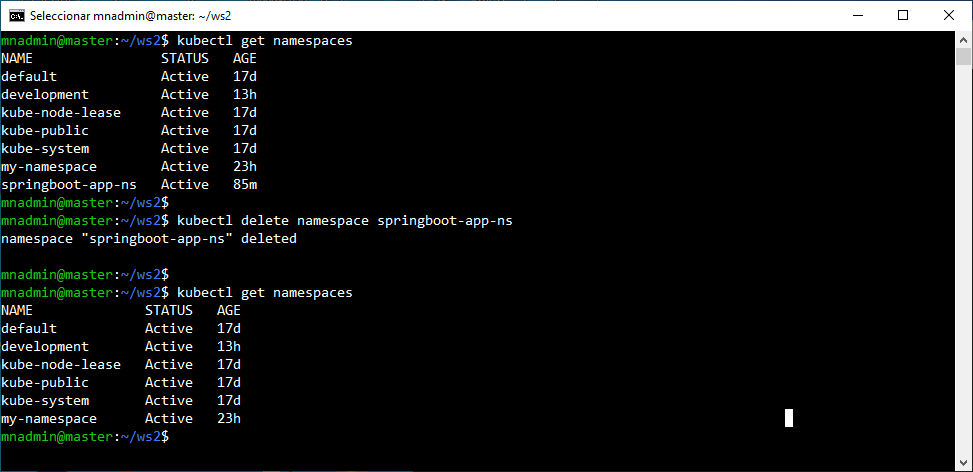

# Práctica 4.5 App Spring Boot

## Objetivo
- Desplegar una aplicación Spring Boot en K8s.


## Duración aproximada
- 40 minutos.

## Instrucciones

### Paso 1. Configuración del espacio de nombres

Crear un **Namespace** para organizar y aislar los recursos asociados a esta práctica.

1. Crear un nuevo directorio de trabajo en el nodo maestro, por ejemplo, **ws2**.

2. Crear un archivo YAML llamado `namespace.yaml`.

```yaml 
apiVersion: v1
kind: Namespace
metadata:
  name: springboot-app-ns
```

3. Aplicar el YAML para crear el Namespace.

```bash
kubectl apply -f namespace.yaml
```

4. Verificar la creación del Namespace.

```bash
kubectl get namespaces

kubectl get namespace springboot-app-ns

kubectl describe namespace springboot-app-ns
```

<br/>

### Paso 2. Crear el ConfigMap

Definir un **ConfigMap** para almacenar las variables de configuración de la aplicación.

1. Crear un archivo YAML llamado **configmap.yaml**.

```yaml
apiVersion: v1
kind: ConfigMap
metadata:
  name: springboot-app-config
  namespace: springboot-app-ns
data:
  SPRING_DATASOURCE_URL: "jdbc:h2:mem:testdb"
  SPRING_DATASOURCE_USERNAME: "sa"
  SPRING_DATASOURCE_PASSWORD: ""
  DK_PARTICIPANTE: "nombre"
```

2. Aplicar el archivo YAML para crear el **ConfigMap**.

```bash
kubectl apply -f configmap.yaml
```

3. Verificar la creación del **ConfigMap**.

```bash
kubectl describe configmap springboot-app-config -n springboot-app-ns

# Detalles del ConfigMap.

kubectl get configmap springboot-app-config -n springboot-app-ns -o yaml

```

<br/>

### Paso 3. Definir el Deployment con dos réplicas

El Deployment especificará que deseas tener dos réplicas de la aplicación, _distribuidas en dos Pods_.

1. Crear un archivo YAML llamado `deployent.yaml`.

```yaml

apiVersion: apps/v1
kind: Deployment
metadata:
  name: springboot-app-deployment
  namespace: springboot-app-ns
spec:
  replicas: 2
  selector:
    matchLabels:
      app: springboot-app
  template:
    metadata:
      labels:
        app: springboot-app
    spec:
      containers:
        - name: springboot-app
          image: <dockerhub-username>/<springboot-app>:<versión>  # Reemplaza los datos correspondientes a tu imagen en Docker Hub
          ports:
            - containerPort: <puerto-imagen-Docker> # Reemplaza el puerto expuesto en la aplicación de tu imagen en Docker Hub
          envFrom:
            - configMapRef:
                name: springboot-app-config

```

- **Nota**:  Reemplaza <dockerhub-username>/<springboot-app>:<versión> con la imagen en tu cuenta en Docker Hub. Por ejemmplo la imagen creada en la práctica 1.6.

2. Aplicar el archivo YAML para crear el **Deployment**.

```bash
kubectl apply -f deployment.yaml
```

3. Verificar los detalles completos del Deployment en Kubernetes.

```bash
kubectl get deployment <deploment-name> -n <namespace>
kubectl describe deployment <deployment-name> -n <namespace>
kubectl get deployment <deployment-name> -n <namespace> -o yaml
```


**Nota**:  Reemplazar `<deployment-name>` con el nombre de tu Deployment y `<namespace>` con el nombre del namespace donde se encuentran tus componentes de Kubernetes.

<br/>

### Paso 4. Exponer el Deployment con un Service

Permitir el acceso a la aplicación desde dentro del clúster, crear un Service de tipo **ClusterIP**.

1. Crear un archivo YAML llamado `service.yaml`:

```yaml
apiVersion: v1
kind: Service
metadata:
  name: springboot-app-service
  namespace: springboot-app-ns
spec:
  selector:
    app: springboot-app
  ports:
    - protocol: TCP
      port: <puerto>  # Puerto del Service accesible para otros componentes del clúster.
      targetPort: <puerto-imagen-Docker> # Puerto en el contenedor donde corre la aplicación
  type: ClusterIP
```

2. Aplicar el archivo YAML para crear el Service.

```bash
kubectl apply -f service.yaml
```

3. Verificar el servicio creado.

```bash
kubectl get svc -n <namespace>

kubectl get services -n <namespace>
```

<br/>

### Paso 5. Verificar el despliegue

1. Asegúrate de que los Pods estén en ejecución:

```bash
kubectl get pods -n <namespace>
```

2. Verificar que el servicio esté creado correctamente:

```bash
kubectl get svc -n <namespace>
```

3. Validar los objetos creados en un Namespace específico, puedes utilizar el siguiente comando de Kubernetes.

```bash
kubectl get all -n <namespace>
```

**Nota**: Reemplaza <namespace> por el nombre de tu namespace, por ejemplo, `springboot-app-ns`.

<br/>

### Paso 6. Consumir el servicio

Para consumir tu servicio utilizando `curl` o `wget` desde dentro del clúster de Kubernetes, puedes emplear la dirección IP del clúster (CLUSTER-IP) y el puerto expuesto (PORT) del servicio. En el caso de la documentación de esta práctica, el servicio `springboot-app-service` tiene asignada la dirección IP **10.111.232.187** y expone el puerto **8095**.

Realiza pruebas de consumo desde ambos nodos, tanto el nodo maestro (Master Node) como el nodo trabajador (Worker Node).

**Notas:**

1. ¿Lograste consumir el servicio? ¿Pudiste hacerlo desde ambos nodos (Master Node y Worker Node)? Explica las razones detrás del éxito o la dificultad al realizar el consumo desde cada nodo.

2. A continuación te damos algunas formas de consumir el servicio de tipo CLUSTER-IP.
   

<br/>

#### Opción A. Ejecutar el curl/wget dentro del clúster.

- Si ejecutas curl desde otro Pod en el mismo clúster, puedes hacer lo siguiente:


    ```bash
    curl http://<ip-servicio>:<puerto-servicio>/<path-app>

    # En la documentación de la práctica quedaron los valores siguientes
    curl http://10.111.232.187:8095/api/clients
    
    ```

<br/>

#### Opción B. Usar el nombre del servicio en lugar de la IP.

- En Kubernetes, los servicios pueden ser alcanzados por su nombre.

   ```bash

    curl http://<nombre-del-servicio><puerto-del-servicio>/<app-path>

    # En la documentación de la práctica quedaron los valores siguientes:
    curl http://springboot-app-service:8095/api/clients
   ```

<br/>

#### Opción C. port-forward para consumir desde la máquina local.

- Si deseas acceder al servicio desde la máquina local, utilizar el comando **port-forward** para mapear el puerto del servicio en la máquina:

```bash
kubectl port-forward svc/<nombre-del-servicio> <puerto-imagen-Docker>:<puerto-servicio> -n <namespace>

# En la documentación de la práctica quedaron los valores siguientes:
kubectl port-forward svc/springboot-app-service 9095:8080 -n springboot-app-ns
```

- Luego, puedes consumir el servicio con `curl` o con `wget` en la máquina local:

```bash

wget http://localhost:<puerto-servicio>/<api-path>

# En la documentación de la práctica quedaron los valores siguientes:
wget http://localhost:8080/api/clients
```

**Notas:**
1. Estas opciones te permitirán consumir el servicio utilizando `curl` o `wget`, adaptándose al entorno de trabajo en el que estés operando.  
2. La respuesta del servicio dependerá de la API que hayas incluido en tu imagen Docker. Si utilizaste la API sugerida en la práctica, es posible que la respuesta no contenga datos aún.
  
<br/>

### Paso 7. Limpieza

- Para limpiar todos los recursos creados durante esta práctica en Kubernetes, la forma más sencilla es eliminar el espacio de nombres donde se definieron los objetos. Esto asegurará que todos los recursos asociados dentro de ese espacio de nombres sean eliminados automáticamente, evitando la necesidad de gestionarlos individualmente.

```bash
# Eliminación del namespace.
kubectl delete namespace <namesapce>

# Otra alternativa
kubectl delete -f namespace.yaml

# Nombre sugerido en la práctica.
kubectl delete namespace springboot-app-ns

# Verificación.
kubectl get namespaces
```

<br/><br/>
## Resultado esperado

- Captura de pantalla que muestra el contenido del YAML para crear el espacio de nombres, la aplicación del YAML y vericación del mismo.


<br/>

- Captura de pantalla que muestra el contenido del YAML para crear un ConfigMap, la aplicación del YAML y los detalles del ConfigMap después de crearlo.


<br/>

- Captura de pantalla que muestra el contenido del YAML para crear un Deployment, la aplicación del YAML y verificación de la creación del mismo.


<br/>

- Captura de pantalla que muestra los detalles del Deployment creado en el punto anterior.


<br/>

- Captura de pantalla que muestra el contenido del YAML para crear el Service, la aplicación del YAML y la verificación del Servicio, nombre, IP y puerto del servicio.


<br/>

- Captura de pantalla que muestra nuevamente la creación del servcio, así como la salida de `kubectl describe` del Service. 


<br/>

- Captura de pantalla que muestra el contenido del JSON con las propiedades del objeto a insertar, la verificación de la cantidad y nombres de los Pods, la verificación de los detalles de conexión del servicio y el consumo, usando el comando **curl**.


<br/>

- Captura de pantalla que muestra el contenido JSON de un segundo objeto a insertar en el servicio y la verificación de los objetos insertados.


<br/>

- Captura de pantalla que muestra las inconsistencias al tener una replica de ambos servicios, y al gestionar la base de datos en memoria. Observe como una misma petición se encuentra balanceada entre las replicas creadas y los datos en cada solicitud pueden ser diferentes.


<br/>

- Captura de pantalla que muestra el consumo del servicio desde un Pod temporal, utilizando el comando **wget** y **springboot-app-service** en lugar de la IP.


<br/>

- Captura de pantalla que muestra el consumo del servicio, usando la opción **port-forward**, observe como los consumos pueden realizarce usando _http://localhost_ 


<br/>

- Captura de pantalla que muestra un listado de todos los YAMLs usados en esta práctica.


<br/>

- Captura de pantalla que muestra la tarea de limpieza de los recursos creados en el namespace de la práctica.



<br/>
