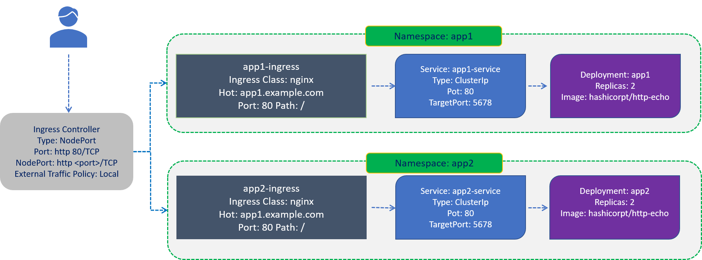
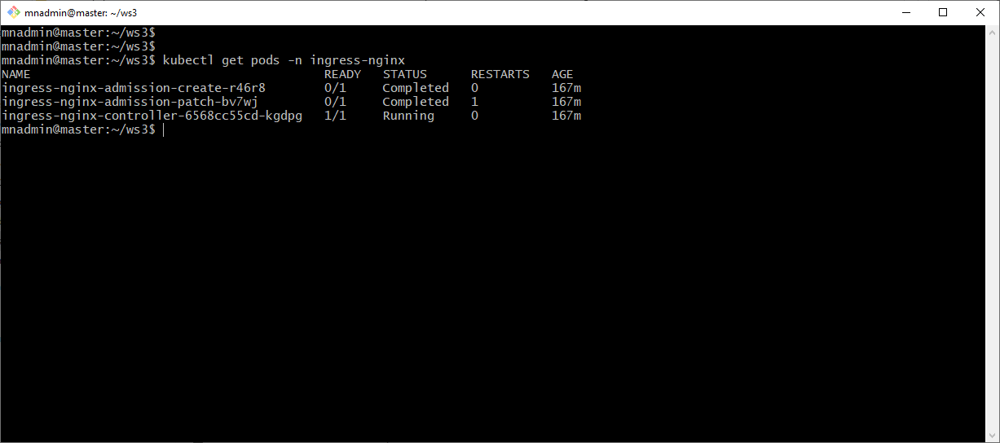
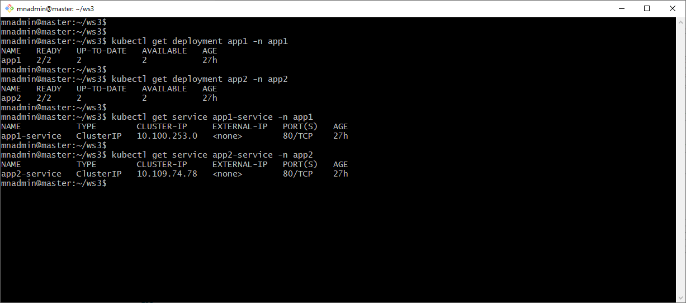
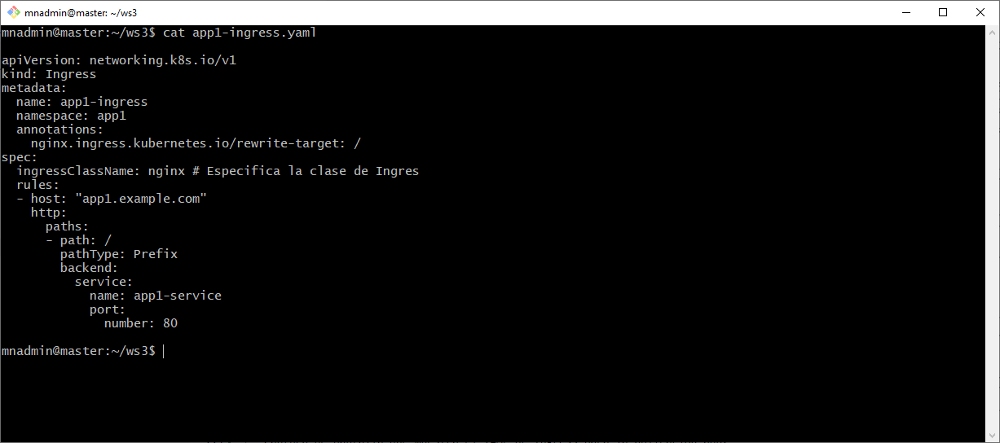
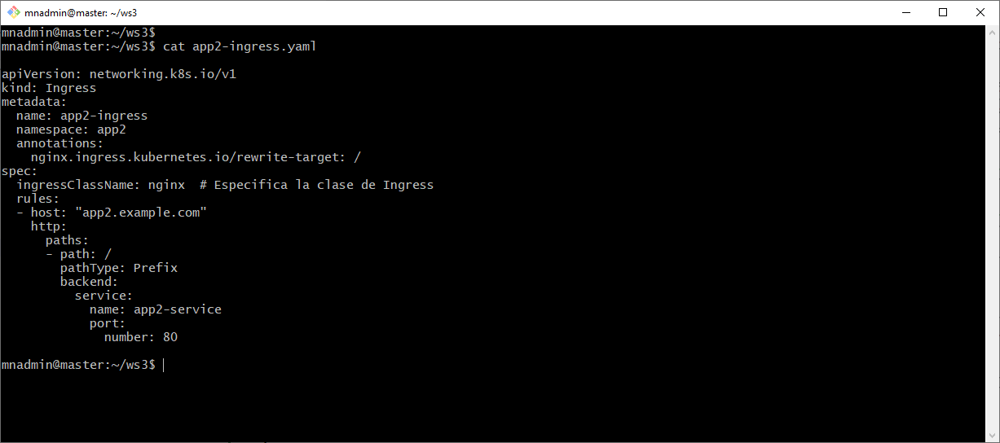
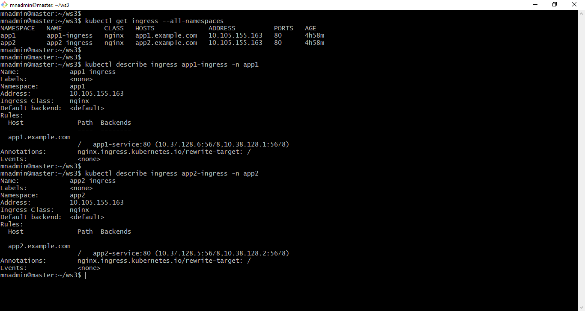
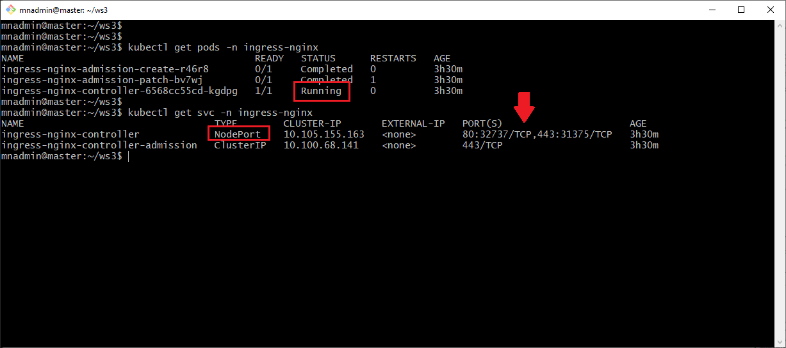
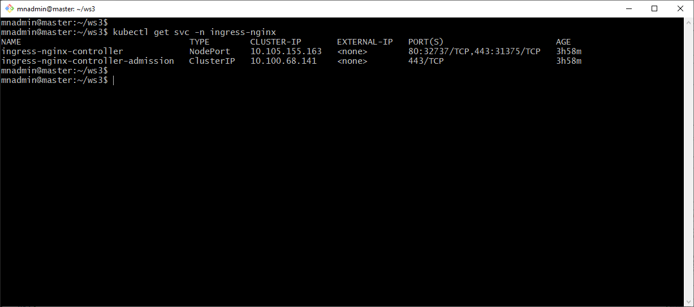

# Práctica 5.3 Configuración de Kubernetes Ingress

## Objetivo

Al finalizar esta práctica, serás capaz de implementar y configurar Kubernetes Ingress, incluyendo el uso de reglas de enrutamiento basadas en rutas y hosts para dirigir el tráfico de red hacia aplicaciones específicas en el clúster.

## Objetivo Visual




## Duración aproximada

45 minutos


## Instrucciones

### Paso 1. Ingress

- Ingress Controller instalado (como NGINX Ingress Controller)

- Puedes installar el NGINX Ingress Controller en el clúster ejecutando el siguiente comando:

```bash
kubectl apply -f https://raw.githubusercontent.com/kubernetes/ingress-nginx/main/deploy/static/provider/cloud/deploy.yaml

```

- Verifica que el controlador esté en funcionamiento

```bash
kubectl get pods -n ingress-nginx
```
<br/>

### Paso 2. Crear namespaces y las aplicaciones de prueba

1. Crea dos espacios de nombres para alojar tus aplicaciones, de forma imperativa puedes usar los dos comandos siguientes:

```bash
kubectl create namespace app1
kubectl create namespace app2
```

<br/>

2. Despliega aplicaciones de prueba en estos espacios de nombres

- YAML para el Deployment de app1 (app1-deployment.yaml)


```yaml
apiVersion: apps/v1
kind: Deployment
metadata:
  name: app1
  namespace: app1
spec:
  replicas: 2
  selector:
    matchLabels:
      app: app1
  template:
    metadata:
      labels:
        app: app1
    spec:
      containers:
      - name: app1
        image: hashicorp/http-echo
        args:
          - "-text=Hello from App1"  # Mensaje para la aplicación 1
        ports:
          - containerPort: 5678

```

- YAML para el Deployment de app2 (app2-deployment)

```yaml
apiVersion: apps/v1
kind: Deployment
metadata:
  name: app2
  namespace: app2
spec:
  replicas: 2
  selector:
    matchLabels:
      app: app2
  template:
    metadata:
      labels:
        app: app2
    spec:
      containers:
      - name: app2
        image: hashicorp/http-echo
        args:
          - "-text=Hello from App2"  # Mensaje para la aplicación 1
        ports:
          - containerPort: 5678


```

- YAML para el Service de app1 (app1-service.yaml)


```yaml
apiVersion: v1
kind: Service
metadata:
  name: app1-service
  namespace: app1
spec:
  selector:
    app: app1
  ports:
    - protocol: TCP
      port: 80
      targetPort: 5678
  type: ClusterIP
```

- YAML para el Service de app2 (app2-service.yaml)


```yaml
apiVersion: v1
kind: Service
metadata:
  name: app2-service
  namespace: app2
spec:
  selector:
    app: app2
  ports:
    - protocol: TCP
      port: 80
      targetPort: 5678
  type: ClusterIP

```

<br/>

3. Aplica todos los YAMLs

```bas
kubectl apply -f app1-deployment.yaml
kubectl apply -f app1-service.yaml
kubectl apply -f app2-deployment.yaml
kubectl apply -f app2-service.yaml

```

<br/>

### Paso 3. Configurar Ingress

1. YAML que deine las reglas para enrutar el tráficos hacia la aplicaciones app1, en función de la ruta y el host (app1-ingres.yaml)


```yaml
apiVersion: networking.k8s.io/v1
kind: Ingress
metadata:
  name: app1-ingress
  namespace: app1
  annotations:
    nginx.ingress.kubernetes.io/rewrite-target: /
spec:
  ingressClassName: nginx # Especifica la clase de Ingres
  rules:
  - host: "app1.example.com"
    http:
      paths:
      - path: /
        pathType: Prefix
        backend:
          service:
            name: app1-service
            port:
              number: 80

```

2. YAML que deine las reglas para enrutar el tráficos hacia la aplicaciones app1, en función de la ruta y el host (app2-ingres.yaml).

```yaml
apiVersion: networking.k8s.io/v1
kind: Ingress
metadata:
  name: app2-ingress
  namespace: app2
  annotations:
    nginx.ingress.kubernetes.io/rewrite-target: /
spec:
  ingressClassName: nginx  # Especifica la clase de Ingress
  rules:
  - host: "app2.example.com"
    http:
      paths:
      - path: /
        pathType: Prefix
        backend:
          service:
            name: app2-service
            port:
              number: 80

```

<br/>

3. Aplica los archivos YAML

```bash
kubectl apply -f app1-ingress.yaml
kubectl apply -f app2-ingress.yaml
```

<br/>

4. Verificar Ingress

- Lista todos los Ingress en el clúster. Esto confirma que los objetos Ingres están creados y activos en sus respectivos NameSpaces.

```bash
kubectl get ingress --all-namespaces
```

- Describe el Ingress para ver sus detalles. Este comando muestra la configuración específica de cada Ingress, incluyendo reglas y rutas:

```bash
# kubectl describe ingress <nombre-del-ingress> -n <namespace>
kubectl describe ingress app1-ingress -n app1
kubectl describe ingress app2-ingress -n app2

```

- Verifica los Pods del controlador de Ingress. Asegúrate de que el controlador de Ingress (como ingress-nginx) está ejecutándose correctamente:

```bash
kubectl get pods -n ingress-nginx
```

- En caso de errores verificar las bitácoras puede ser útil, utiliza el siguiente comando:

```bash
kubectl logs <nombre-pod-ingress-controller> -n ingress-nginx
```

- Revisa los servicios del controlador de Ingress. Si el servicio del controlador de Ingress está configurado como NodePort o LoadBalancer, verifica la IP y puerto:

```bash
kubectl get svc -n ingress-nginx
```

<br/>

### Paso 4. Probar el enrutamiento

1. Verifica la IP del Ingress Controller

```bash 
kubectl get svc -n ingress-nginx
```

- Busca el servicio del controlador NGINX, que generalmente tiene un tipo `LoadBalancer` o `NodePort`. La columna ]]**EXTERNAL-IP** te indicará la IP pública del Ingress. Si el campo **EXTERNAL-IP** muestra <pending>, espera unos minutos o verifica la configuración del controlador.

- El estado `<pending>` en **EXTERNAL-IP** para el servicio `ingress-nginx-controller` significa que el clúster de Kubernetes no ha podido asignar una IP externa al Ingress Controller, esto debido a que no estás usando un proveedor de nube que soporte automáticamente balanceadores de carga (LoadBalancer), como GKE, EKS o AKS.

- Si estás ejecutando el clúster en un entorno local, como **Minikube** o una configuración de máquinas virtuales en VirtualBox, Kubernetes no puede asignar una IP externa automáticamente.  

- Probablemente tendrás que cambiar de el tipo de servicio a **NodePort**

a. Edita el servicio ingress-nginx-controller para cambiarlo a tipo NodePort, lo que le permitirá exponer el Ingress Controller a través de un puerto específico del nodo:

```bash
kubectl edit svc ingress-nginx-controller -n ingress-nginx
```

b. En el editor, cambia type: LoadBalancer a type: NodePort, y guarda los cambios. El archivo debería verse algo así:

```yaml
spec:
  type: NodePort
```

c. Verifica los cambios, con el siguiente comando:

```bash
kubectl get svc -n ingress-nginx
```

<br/>

2. Para que el Ingress redirije correctamente el tráfico, debes especificar el nombre de host en el encabezado Host cuando uses curl. 

```bash
# curl -H "Host: app1.example.com" http://<NODE_IP>:<NodePort>
# curl -H "Host: app2.example.com" http://<NODE_IP>:<NodePort>

# IPs del clúster
curl -H "Host: app1.example.com" http://10.105.155.163:80
curl -H "Host: app2.example.com" http://10.105.155.163:80

# IPs externas
curl -H "Host: app1.example.com" http://192.168.0.3:32737
curl -H "Host: app2.example.com" http://192.168.0.3:32737

```

<br/><br/>
## Resultado Esperado 


- Captura de pantalla que muestra la verificacion del controlador Ingress funciona correctamente



<br/>

- Captura de pantalla que muestra la verificacion de los espacios de nombres app1 & app2. Además de los dos servicios app1-service & app2-service



 
 br/>

- Captura de pantalla que muestra el YAML de Ingress para la aplicación app1.


 
<br/>

 - Captura de pantalla que muestra el YAML de Ingress para la aplicación app2.



<br/>

- Captura de pantalla que muestra la verificacion del enrutamiento de Ingress en Kubernetes, **kubectl describe** muestra información detallada, incluidas las reglas de enrutamiento basadas en host y path, y el estado del controlador asociado.



<br/>

- Captura de pantalla que confirma que el controlador de Ingress está ejecutándose. Además de verificar el servicio Ingress Controller, este se encuentra como NodePort, el puerto externo está abierto y accesible.



<br/>

- Captura de pantalla que muestra un puerto en la columna PORT(S), como **80:<NodePort>/TCP**. Este **NodePort** permite acceder al Ingress Controller usando la IP del nodo de Kubernetes y el puerto asignado.



<br/>


- La configuración de Ingress en Kubernetes está funcionando correctamente, ya que las pruebas de enrutamiento mediante curl muestran que las solicitudes dirigidas a app1.example.com y app2.example.com reciben las respuestas esperadas desde los servicios correspondientes. Además, la configuración en el archivo /etc/hosts permite la resolución local de nombres de host, facilitando el acceso y verificación del enrutamiento a través del controlador de Ingress expuesto en un puerto específico (NodePort).


<br/>

<br/>

### Resumen de la configuración

1. Creaste dos aplicaciones en diferentes namespaces (app1 y app2).

2. Configuraste servicios para exponerlas internamente.

3. Configuraste un Ingress con reglas basadas en hosts.

4. Probaste el enrutamiento accediendo a app1.example.com y app2.example.com.

Este Ingress ahora redirige el tráfico adecuadamente según las reglas de hosts y rutas configuradas.


### Si tienes problemas con la práctica, aquí algunas pistas.

1. Confirma que los recursos Ingress están aplicados en los namespaces correctos.

2.  Verifica que las reglas de cada Ingress coincidan con los hosts.

3. Asegúrate de que el encabezado Host en las solicitudes curl coincida con los hosts configurados.

4. Revisa los logs del Ingress Controller para más información.

5. Revisa el archivo de hosts local para que los nombres de host apunten a la IP del nodo.


### Resumen de comandos

Cada comando de esta lista se ha usado para configurar, diagnosticar o resolver problemas relacionados con Ingress, servicios y redes en Kubernetes.  

<br/>

1. Verificación de Pods y Servicios:

```bash
 
kubectl get pods -n ingress-nginx
kubectl get svc -n ingress-nginx
kubectl get pods -n app1
kubectl get pods -n app2
kubectl get svc -n app1
kubectl get svc -n app2
kubectl get ingress -n app1
kubectl get ingress -n app2
```

2. Aplicar Archivos de Configuración:

```bash
 
kubectl apply -f app1-ingress.yaml
kubectl apply -f app2-ingress.yaml
```


3. Editar Recursos:

```bash
kubectl edit svc ingress-nginx-controller -n ingress-nginx
```

4. Reinicio de Recursos:

```bash
kubectl delete pod -l app.kubernetes.io/name=ingress-nginx -n ingress-nginx
kubectl rollout restart deployment ingress-nginx-controller -n ingress-nginx
kubectl -n kube-system rollout restart daemonset kube-proxy
```

5. Ver Logs:

```bash
kubectl logs -n ingress-nginx -l app.kubernetes.io/name=ingress-nginx
```

6. Redirección de Puerto (Port-Forwarding):

```bash

kubectl port-forward -n app2 svc/app2-service 32737:80
```

7. Eliminar y Volver a Instalar Ingress Controller:

```bash
kubectl delete -f https://raw.githubusercontent.com/kubernetes/ingress-nginx/main/deploy/static/provider/cloud/deploy.yaml
kubectl apply -f https://raw.githubusercontent.com/kubernetes/ingress-nginx
```

<br/>

## Referencias

- 

- 

- 